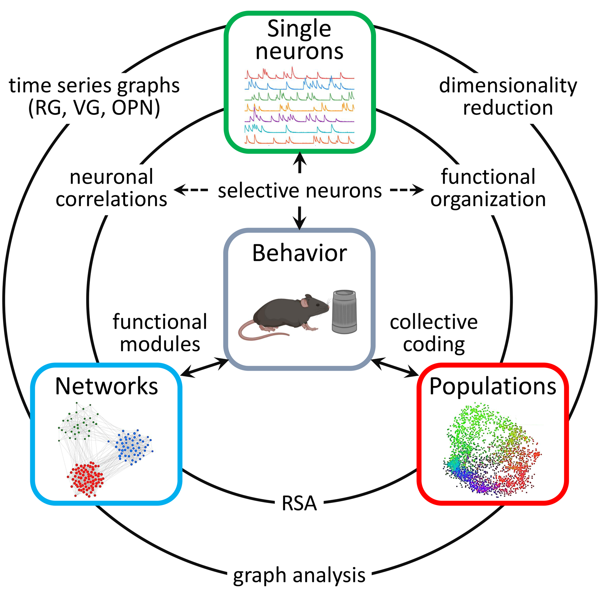

# DRIADA

**D**imensionality **R**eduction for **I**ntegrated **A**ctivity **D**ata **A**nalysis — a Python framework for cross-scale analysis of neural population activity.

[](https://www.python.org/downloads/)
[](https://pypi.org/project/driada/)
[](https://pypi.org/project/driada/)
[](LICENSE)
[](https://github.com/iabs-neuro/driada/actions/workflows/tests.yml)
[](https://codecov.io/gh/iabs-neuro/driada)
[](https://driada.readthedocs.io/en/latest/)
[](https://github.com/iabs-neuro/driada/actions/workflows/tests.yml)

## Integrating analysis scales

Neuroscience describes brain activity through three complementary paradigms: **single-neuron selectivity** (what does each cell encode?), **population dynamics** (what is the collective geometry?), and **networks** (how are units connected?). These are not competing theories — they are complementary lenses on the same data. The same neuron can be viewed simultaneously as a feature detector, a dimension of a population manifold, and a node in a functional circuit.

Yet in practice, each paradigm has its own tools, its own data formats, its own packages. If you want to ask a question that crosses paradigm boundaries — *does selectivity predict network membership? does filtering by tuning improve manifold structure? how do individual neurons contribute to population coding? do temporal dynamics of single neurons reveal population-level organisation?* — you have to build a custom pipeline from incompatible parts.

DRIADA provides a **shared data model** where all three paradigms operate on the same objects. Results from one domain flow directly into the others:

<p align="center">
  
</p>

Three bidirectional bridges connect the paradigms:

- **Neurons ↔ Populations.** Selective neurons filter the population matrix for dimensionality reduction; embedding coordinates feed back into neuron-level importance estimation, revealing which cells drive each manifold dimension.
- **Neurons ↔ Networks.** Pairwise MI significance testing builds functional connectivity from neural activity; per-neuron recurrence graphs, visibility graphs, and ordinal partition networks yield functional networks grounded in temporal dynamics rather than correlations.
- **Populations ↔ Networks.** Graph-based dimensionality reduction (Isomap, diffusion maps) returns proximity graphs that inherit the full network toolkit — spectral decomposition, community detection, entropy — without format conversion. RSA provides a complementary route from population representations to network structure.

DRIADA's strength is integrating these scales — crossing them should be a function call, not a weekend of data wrangling.

## 🔬 Key Capabilities

- 🧠 **INTENSE** — detect neuron-feature selectivity via mutual information with rigorous two-stage statistical testing, delay optimization, and mixed selectivity disentanglement
- 📊 **Dimensionality Reduction** — linear (PCA), graph-based (Isomap, diffusion maps, LLE), neighbor-embedding (UMAP, t-SNE), and neural network-based (autoencoders) with manifold quality metrics
- 📐 **Dimensionality Estimation** — PCA-based, effective rank, k-NN, correlation, and geodesic dimension
- 🔗 **Integration** — map single-cell selectivity onto population manifolds and embedding components
- 🌐 **Network Analysis** — general-purpose graph analysis (spectral, entropy, communities) for connectomes, functional networks, or dimensionality reduction proximity graphs
- 🔄 **Recurrence Analysis** — delay embedding, recurrence plots, RQA, visibility graphs, ordinal partition networks for nonlinear dynamics and population module recovery
- 📏 **RSA** — representational dissimilarity matrices, cross-region and cross-session comparisons
- 🧪 **Synthetic Data** — generate populations with known ground truth for validation
- ⚡ **Neuron** — calcium kinetics optimization (rise/decay fitting), event detection, and signal quality metrics

## 🚀 Tutorials

Interactive notebooks — click a badge to open in Google Colab (no setup required):

| | Notebook | Topics |
|---|---|---|
| [](https://colab.research.google.com/github/iabs-neuro/driada/blob/main/notebooks/00_driada_overview.ipynb) | **DRIADA overview** | `Experiment` objects, feature types, quick tour of INTENSE, dimensionality reduction, networks |
| [](https://colab.research.google.com/github/iabs-neuro/driada/blob/main/notebooks/01_data_loading_and_neurons.ipynb) | **Neuron analysis** | Spike reconstruction, kinetics optimization, quality metrics, surrogates |
| [](https://colab.research.google.com/github/iabs-neuro/driada/blob/main/notebooks/02_selectivity_detection_intense.ipynb) | **Selectivity detection (INTENSE)** | Mutual information, two-stage testing, optimal delays, mixed selectivity |
| [](https://colab.research.google.com/github/iabs-neuro/driada/blob/main/notebooks/03_population_geometry_dr.ipynb) | **Population geometry & DR** | PCA, UMAP, Isomap, autoencoders, manifold quality metrics, dimensionality estimation |
| [](https://colab.research.google.com/github/iabs-neuro/driada/blob/main/notebooks/04_network_analysis.ipynb) | **Network analysis** | Cell-cell significance, spectral analysis, communities, graph entropy |
| [](https://colab.research.google.com/github/iabs-neuro/driada/blob/main/notebooks/05_advanced_capabilities.ipynb) | **Advanced capabilities** | Embedding selectivity, leave-one-out importance, RSA, RNN analysis |
| [](https://colab.research.google.com/github/iabs-neuro/driada/blob/main/notebooks/06_recurrence_analysis.ipynb) | **Recurrence analysis** | Delay embedding, recurrence plots, RQA, visibility & ordinal graphs, population module recovery |

All notebooks generate synthetic data internally — no external files needed. See the [examples reference](https://driada.readthedocs.io/en/latest/examples.html) for 25+ standalone scripts covering additional use cases.

## Data

DRIADA is designed for **calcium imaging** data but works with any neural activity represented as a `(n_units, n_frames)` array — RNN activations, firing rates, LFP channels, or anything else. Behavioral variables are 1D or multi-component arrays of the same length. Variable types (continuous, discrete, circular, multivariate) are auto-detected and preprocessed appropriately.

**Input workflow:** load your arrays into a Python dict and call `load_exp_from_aligned_data`:

```python
from driada.experiment import load_exp_from_aligned_data
from driada.intense import (compute_cell_feat_significance,
    compute_cell_cell_significance, compute_embedding_selectivity)
from driada.rsa import compute_experiment_rdm
from driada.network import Network
from driada.integration import get_functional_organization
import scipy.sparse as sp

data = {
    'calcium': calcium_array,       # (n_neurons, n_frames) — or 'activations', 'rates', etc.
    'speed': speed_array,           # (n_frames,) continuous variable
    'position': position_array,     # (2, n_frames) multi-component variable
    'head_direction': hd_array,     # auto-detected as circular
    'trial_type': trial_type_array, # auto-detected as discrete
}

exp = load_exp_from_aligned_data('MyLab', {'name': 'session1'}, data,
                                 static_features={'fps': 30.0})

feat_stats, feat_sig, *_ = compute_cell_feat_significance(exp)       # neuron-feature selectivity
cell_sim, cell_sig, *_ = compute_cell_cell_significance(exp)         # functional connectivity
net = Network(adj=sp.csr_matrix(cell_sig), preprocessing='giant_cc') # network analysis
embedding = exp.create_embedding('umap', n_components=2)             # dimensionality reduction
rdm, labels = compute_experiment_rdm(exp, items='trial_type')        # representational similarity
emb_res = compute_embedding_selectivity(exp, ['umap'])               # which neurons encode which components
org = get_functional_organization(exp, 'umap',
    intense_results=emb_res['umap']['intense_results'])              # selectivity-to-embedding bridge
```

You can also load directly from `.npz` files via `load_experiment()`. See the [RNN analysis tutorial](https://colab.research.google.com/github/iabs-neuro/driada/blob/main/notebooks/05_advanced_capabilities.ipynb) for a non-calcium example.

## Installation

```bash
pip install driada

# Optional extras
pip install driada[gpu]   # autoencoders, torch-based methods
pip install driada[mvu]   # MVU dimensionality reduction (cvxpy)
pip install driada[all]   # everything

# From source
git clone https://github.com/iabs-neuro/driada.git
cd driada
pip install -e ".[dev]"
```

DRIADA pulls in ~30 dependencies (numpy, scipy, scikit-learn, numba, joblib, etc.). See [pyproject.toml](pyproject.toml) for the full list.

## Documentation

📖 **[driada.readthedocs.io](https://driada.readthedocs.io)** — API reference, installation guide, and quickstart
📋 **[Changelog](CHANGELOG.md)** — release history and migration notes

## Contributing

We welcome contributions! Please see [CONTRIBUTING.md](CONTRIBUTING.md) for guidelines.

```bash
git clone https://github.com/iabs-neuro/driada.git
cd driada
pip install -e ".[dev]"
pytest
```

## Citation

If you use DRIADA in your research, please cite:

```bibtex
@software{driada2026,
  title = {DRIADA: Dimensionality Reduction for Integrated Activity Data Analysis},
  author = {Pospelov, Nikita and contributors},
  year = {2026},
  url = {https://github.com/iabs-neuro/driada}
}
```

## Publications

DRIADA has been used in the following research:

### Biological neural systems
- **[Sotskov et al. (2022)](https://doi.org/10.3390/ijms23020638)** — Fast tuning dynamics of hippocampal place cells during free exploration
- **[Pospelov et al. (2024)](https://doi.org/10.1109/DCNA63495.2024.10718588)** — Effective dimensionality of hippocampal population activity correlates with behavior
- **[Bobyleva et al. (2025)](https://doi.org/10.1162/netn_a_00439)** — Multifractality of structural connectome eigenmodes

### Artificial neural networks
- **[Kononov et al. (2025)](https://arxiv.org/abs/2510.11162)** — Hybrid computational dynamics in RNNs through reinforcement learning

### Methodological applications
- **[Pospelov et al. (2021)](https://doi.org/10.1016/j.ynirp.2021.100035)** — Laplacian Eigenmaps for fMRI resting-state analysis

**See [PUBLICATIONS.md](PUBLICATIONS.md) for the complete list with abstracts and details.**

## Support

- 📧 **Email**: pospelov.na14@physics.msu.ru
- 🐛 **Issues**: [GitHub Issues](https://github.com/iabs-neuro/driada/issues)
- 💬 **Discussions**: [GitHub Discussions](https://github.com/iabs-neuro/driada/discussions)

## License

This project is licensed under the MIT License — see the [LICENSE](LICENSE) file for details.
